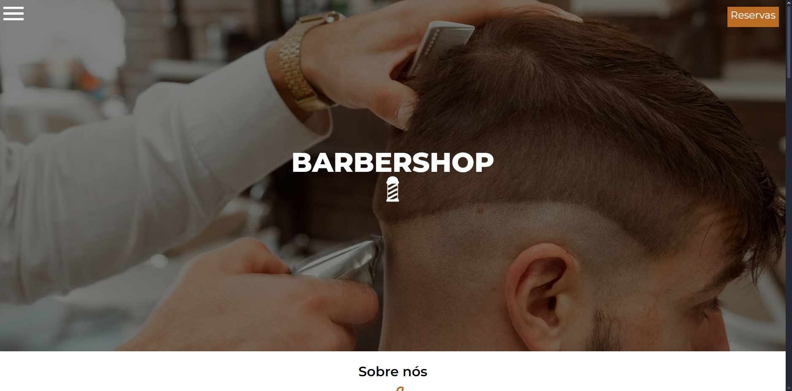

&#xa0;

<h1 align='center'>Barber Shop</h1>

<!--  -->

<!--  -->

<!--  -->

<!--  -->

 

## :dart: Sobre ##

  Este projeto foi desenvolvido utilizando tecnologias simples e eficazes como HTML, CSS e JavaScript, com o objetivo de criar uma experiência web atraente e funcional para os visitantes da barbearia fictícia. A landing page foi projetada para apresentar de forma elegante e intuitiva os serviços oferecidos pela barbearia. 

## :sparkles: Tecnologias Utilizadas ##

- HTML: Estruturação do conteúdo da página.

- CSS: Estilização visual, garantindo um layout responsivo e moderno.

- JavaScript: Interatividade e funcionalidades adicionais para uma melhor experiência do usuário.

## :sparkles: Funcionalidades ##

- Navegação intuitiva com menu responsivo.

- Seções informativas sobre os serviços oferecidos.

- Formulário de agendamento funcional.

- Efeitos de transição suaves para uma experiência de rolagem agradável.

